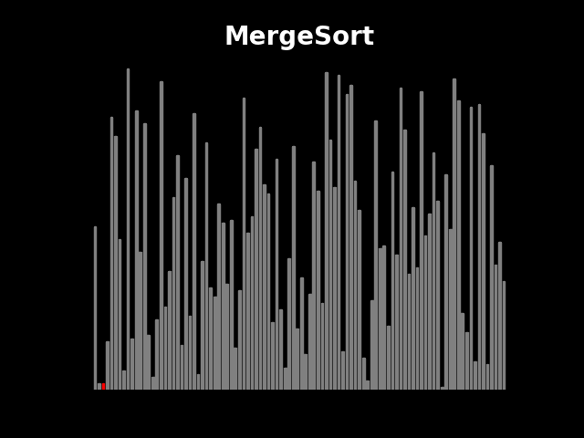
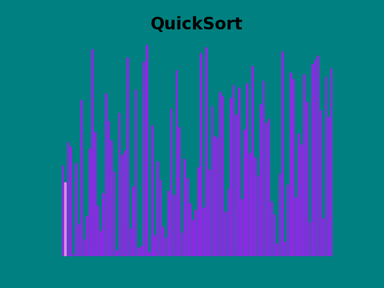

# Usage:
`python main.py [-h] [-N <int>] [-o <str>] [-a <str>] [-bc <color>] [-pc <color>] [--bg-color <color>] [--tt-c <color>] `

## options:
  - `-h`, `--help`          show this help message and exit
  - `-N <int>`            number of elements to sort
  - `-o <str>`            name of file in which the result will be stored
  - `-a <str>`            which sorting algorithm to use: `['quick', 'insertion', 'merge']`
  - `-bc <color>`         color of bars
  - `-pc <color>`         color of pivot
  - `--bg-color <color>`  background color
  - `--tt-c <color>`      title text color

# Examples
`python .\main.py -N 100 -o merge_sort_demo -bc gray -pc red --bg-color black --tt-c white`

--- 

`python .\main.py -N 100 -a quick -o quick_sort_demo -bc blueviolet -pc violet --bg-color teal`

---

`python .\main.py -N 100 -a insertion -o insertion_sort_demo -pc gold -bc cyan --bg-color darkmagenta --tt-c navy`

